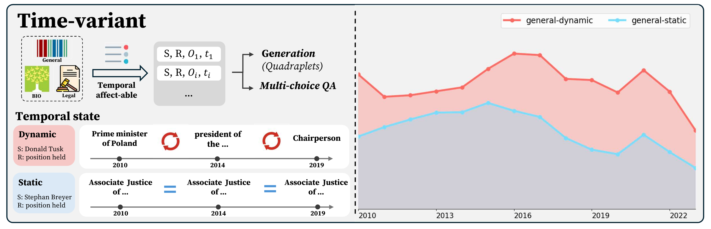
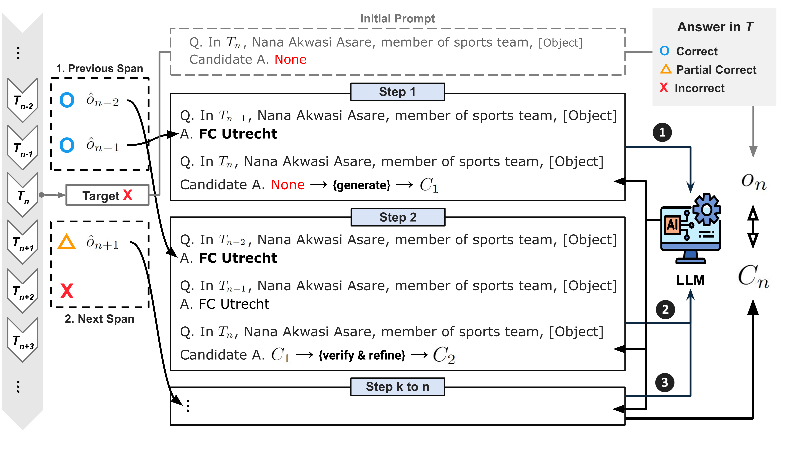

# ChroKnowledge: Unveiling Chronological Knowledge of Language Models in Multiple Domains

## Overview
**ChroKnowledge** is a research framework designed to evaluate and update the chronological knowledge of large language models (LLMs). It builds on the **ChroKnowBench** dataset, which enables testing LLMs' ability to handle chronologically accumulated knowledge across multiple domains, including general, biomedical, legal, commonsense, and mathematical facts. This repository also features **ChroKnowPrompt**, a technique for in-depth prompting to enhance temporal reasoning and improve the accuracy of LLMs over a timeline.

<p align="center">
    📃 <a href="https://arxiv.org/abs/2410.09870" target="_blank">Paper</a> | 🤗 <a href="https://huggingface.co/datasets/dmis-lab/ChroKnowBench" target="_blank">Datasets</a>
</p>



## Updates
[Oct 11, 2024] We have released the code and data.

## Task Definition
Our knowledge categorization is based on knowledge classification based on the Sampling-based Knowledge Categorization (SliCK) framework by [Gekhman et al](https://arxiv.org/abs/2405.05904):
Sampling the model's answer to question using various few-shot exemplar sets D.
The sampling is conducted under two temperature conditions: $\tau$ = 0 and $\tau$ > 0.
Then categorizes the degree to wich the model knows each piece of knowledge into four levels: *HighlyKnown*, *MaybeKnown*, *WeaklyKnown*, and *Unknown*.
We modify it into three categories as defined below. Knowledge is categorized into:
- **Correct**: All objects generated are included in the answer set.
- **Partial Correct**: At least one generated object is in the answer set.
- **Incorrect**: None of the generated objects are included in the answer set.

| Category        | Definition                                                                                           | Description                                                                                                 |
|-----------------|-------------------------------------------------------------------------------------------------------|-------------------------------------------------------------------------------------------------------------|
| Correct         | $\( \{ \hat{o_i} \mid M(D_i,s,r,t) = \hat{o_i}; M, \tau=0 \}_{i=1}^{n} \subseteq A \)$                  | All objects generated with greedy decoding are entirely included within the answer set.                    |
| Partial Correct | $\( \bigcup_{\tau \in \mathcal{T}} \{ \hat{o_i} \mid M(D_i, s, r, t) = \hat{o_i}; M, \tau \}_{i=1}^{n} \cap A \neq \emptyset \)$ | At least one generated object from greedy decoding or temperature sampling is in the answer set.           |
| Incorrect       | $\( \bigcup_{\tau \in \mathcal{T}} \{ \hat{o_i} \mid M(D_i, s, r, t) = \hat{o_i}; M, \tau \}_{i=1}^{n} \cap A = \emptyset \)$  | None of the generated objects, either from greedy decoding or temperature sampling, are included in the answer set. |

## Datasets
Our **ChroKnowBench** consists of datasets from multiple domains, with characteristics as shown in below:
- **Time-variant Knowledge**: General, biomedical, and legal datasets, containing facts that change over time. It is divided into two temporal state:
   - *dynamic*, where knowledge has evolved over the accumulated period.
   - *static*, where no change occurred during the accumulated period though it has potential to be changed.
- **Time-invariant Knowledge**: Commonsense and mathematics datasets, containing facts that remain constant.

| Time Dependency | Domain (Time Frame) | # of Relations | Structured | Format                   | Temporal State | # of Examples | Source   |
|-----------------|---------------------|----------------|------------|-------------------------|----------------|---------------|----------|
| Time Variant    | General (2010-2023) | 8              | Yes        | (s, r, o, t)            | Dynamic        | 8,330         | Wikidata |
|                 |                     |                |            |                         | Static         | 8,302         | Wikidata |
|                 | Biomedical (2020-2024) | 14           | Yes        | (s, r, o, t)            | Dynamic        | 7,345         | UMLS     |
|                 |                     |                |            |                         | Static         | 7,345         | UMLS     |
|                 | Legal (2010-2023)   | 6*             | No         | QA                      | Dynamic        | 3,142         | CFR      |
|                 |                     |                |            |                         | Static         | 3,142         | CFR      |
| Time Invariant  | Commonsense         | 8              | Yes        | (s, r, o)               | Invariant      | 24,788        | CSKG     |
|                 | Math                | 12             | Yes        | (s, r, o)               | Invariant      | 2,585         | Math-KG  |

\* For LEGAL dataset in time variant, it is the number of category like `Organization', as it is unstructured dataset without specific short relations.

## Installation
To ensure compatibiliity with other libraries, we recommend using the folliwng versions. You can adjust it based on your environments:

- Python 3.10.14
- PyTorch 2.4.0
- CUDA 12.2

Then, follow the order of installation.

1. Clone the repository:
   ```bash
   git clone https://github.com/dmis-lab/ChroKnowledge.git
   cd ChroKnowledge
   ```
2. Install dependencies:
   ```bash
   pip install -r requirements.txt
   ```
3. Download the dataset from HuggingFace:
   ```bash
   huggingface-cli login
   DATASET_DIR="/ChroKnowledge/ChroKnowBench"
   mkdir -p $DATASET_DIR
   datasets-cli download dmis-lab/ChroKnowBench -d $DATASET_DIR
   ```
   ```python
   from datasets import load_dataset
   load_dataset('dmis-lab/ChroKnowBench', cache_dir='/ChroKnowledge/ChroKnowBench')
   ```

## Implementation
### Step 1: Chronological Knowledge Check
To evaluate the initial temporal knowledge of the model, you can run the `run_knowledge_check.sh` script. This script uses a variety of language models, including both open-source and proprietary LLMs, to assess their ability to recall time-sensitive information from different domains of ChroKnowBench. Below is an explanation of the key components:

1. **Set CUDA Devices**: The environment variable `CUDA_VISIBLE_DEVICES` allows you to specify which GPUs to use for running the script.
   ```bash
   export CUDA_VISIBLE_DEVICES=0
   ```
   Adjust this variable according to the GPU resources available.

2. **Model Selection**: The script includes multiple language models such as `Llama3.1_8B` and `gpt-4o-mini`. You can change the `model_name` variable to choose the model you wish to use. If you use OpenAI models, put your api key into `'api_key = "YOUR API KEY"` in `sources/utils.py` file.
   ```bash
   model_name="Llama3.1_8B"
   ```
   ⚠️ Warning: As the basic sampling is five times for each year, be careful for the cost of calling API.

3. **Domain and Template**: You can specify the domain (e.g., `General`, `Biomedical`, `Legal`) and the type of task (`generation`, `QA`) by setting the `domain` and `template` variables, respectively.
   ```bash
   domain="General"
   template="generation"
   ```

4. **Temperature and Decoding**: The script runs the model with different temperature settings (`0.0`, `0.7`) to capture variations in predictions. You can change the temperature variable for different behaviors. Please do both temperature settings for evaluation.
   ```bash
   temperature=0.0
   ```

5. **Running the Script**: After setting up, you can execute the following command to run the model evaluation:
   ```bash
   CUDA_VISIBLE_DEVICES=$CUDA_VISIBLE_DEVICES python ChroKnowledge.py \
       --model_name $model_name \
       --dtype bfloat16 \
       --device_num auto \
       --gpu_util 0.90 \
       --multi_gpu $multi_gpu \
       --max_tokens 50 \
       --domain $domain \
       --template $template \
       --temperature $temperature \
       --save_results True
   ```
   This script helps to evaluate how well the language models can recall time-sensitive knowledge across different domains.

### Evaluation
Use the `run_classification.ipynb` notebook to classify and analyze the model's temporal knowledge.

### Step 2: ChroKnowPrompt Implementation



After running Step 1, you can use the ChroKnowPrompt prompting strategy to enhance the model's ability to recall and reason about chronological knowledge. This is implemented using the `run_chroknow_prompt.sh` script. Below is a detailed breakdown of the process:

1. **Set CUDA Devices**: Specify the GPU to use by setting `CUDA_VISIBLE_DEVICES`.
   ```bash
   export CUDA_VISIBLE_DEVICES=0
   ```

2. **Model Selection**: Choose the language model for this task by modifying the `model_name` variable.
   ```bash
   model_name="Llama3.1_8B"
   ```

3. **Year Span for Temporal Reasoning**: You can configure the `prev_span` and `next_span` variables to determine how far back or forward in time the model should reason during the evaluation.
   ```bash
   prev_span=3
   next_span=3
   ```
   In our setting, we used three year span for both previous and next years.

4. **Running the Script**: To run the script and evaluate the prompting strategy, use the following command:
   ```bash
   CUDA_VISIBLE_DEVICES=$CUDA_VISIBLE_DEVICES python ChroKnowPrompt.py \
       --model_name $model_name \
       --dtype bfloat16 \
       --device_num auto \
       --gpu_util 0.90 \
       --multi_gpu $multi_gpu \
       --max_tokens 50 \
       --domain General \
       --temperature 0.0 \
       --prev_span $prev_span \
       --next_span $next_span \
       --save_results True
   ```
   This script helps the model better navigate chronological changes in the knowledge base, allowing for a more accurate understanding of time-sensitive information.

### Evaluation
Use the `run_evaluation.ipynb` notebook to evaluate the effectiveness of ChroKnowPrompt in improving temporal knowledge recall.

### Citation
```
@article{park2024ChroKnowledge,
  title={ChroKnowledge: Unveiling Chronological Knowledge of Language Models in Multiple Domains},
  author={Yein Park and Chanwoong Yoon and Jungwoo Park and Donghyeon Lee and Minbyul Jeong and Jaewoo Kang},
  journal={arXiv preprint arXiv:2410.09870},
  year={2024}
}
```

### Contact
For any questions or issues, feel free to reach out to [522yein (at) korea.ac.kr].